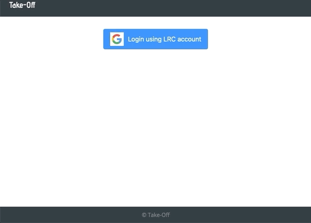

# Take-Off
This web application was built to manage requests for time off (vacation and sick leave) for a local non profit lawfirm in Minneapolis, MN. Users can login either at employee-level or administrator-level. Employees can make requests for off days and then view the status of those requests. Administrators can view the requests of all users and accept or deny requests. The status of a given request (pending, approved, denied) is then communicated back to the employee.

The application is mobile friendly.

## Setup and Run
You will need to follow the steps below to setup the database to get this up and running.

### 1. Create PostgreSQL database named 'take_off'
create db take_off (same as below but creating using SQL statements in terminal)

### 2. Create database tables using SQL create statements in 'database.sql'.
Run the statmesnt below in terminal:
psql -E -f database.sql -d take_off

### Optional: initalize database with sample data found in 'sample.sql'.
psql -E -f sample.sql -d take_off

### 3. Install Node dependencies/libraries using NPM
npm install

### 4. Start the server
npm run server

### 5. Start the client
npm run client

### 6. Application runs locally on PORT 3000

### 7. Login/Aunthentication
You will need to insert your email account into the employee table, because the application checks against the authenticated email google sends back against list of employees.

## Description

This is a full stack application built for a local non profit lawfirm. Employees are able to login in, see how many days they have available for Vacation, and how many days they have for Sick and Safe Time (this is a Minneapolis Ordinance that provide both sick and safe time for employees to use).
They make a request, the application tracks how many days they are taking, if it is over the weekend, the application knows not to include the weekend days.

### Login
Users login using their google accounts. Google OAuth was implemented for authentication to make logging in seamless and uniform for the users. After logging in with your google account, the application checks against the database to verify if the user is authorized to access the application. It checks against the database if a user is registered with the law firm and also if an user has an active status.

#### Employee Login View
When an employee logs in, they see the number of days they have available for Vacation and Sick and safe Time.

#### Admin Login View
When the admin logs in, the application verifies if the user logging in is the admin. The admin has access to all the employee request, can approve or deny requests for the home page.

## Utilized Web Stack
- `User Interface` - React, CSS, react-big-callendar, Material.ui, Sweetalert
- `Client` - React, Redux, Redux-Saga, Axios, Passport
- `Server` - Node.js, Express, Node-Cron
- `Database` - PostgreSQL

## Requirements
- Git
- Web browser
- Node and npm
- PostgreSQL

## Features

### Future Features

## Deployment
In the future this project will be deployed to Heroku

## Authors
- Bode Falade
- Sharmarke Duale
- Max Todd
- Mike Stockman

## Acknowledgements
- We would like to thank Michael Friedman and the rest of the Legal Rights Center
- We would like to thank our instructors Chris Black, Kris Szfranski, Ally Boyd, and Dane Smith
- Thanks to our Prime Digital Academy cohort Zaurak