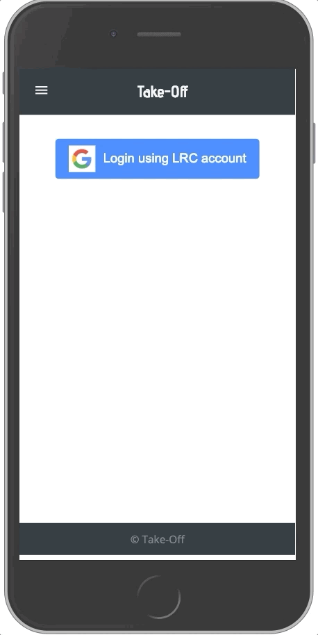
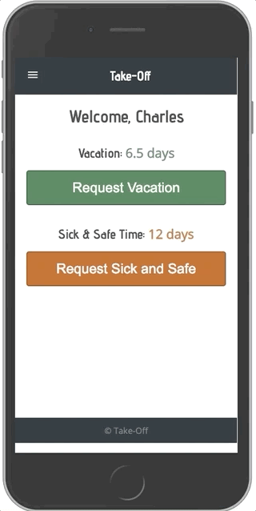
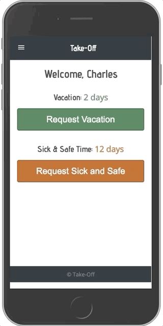
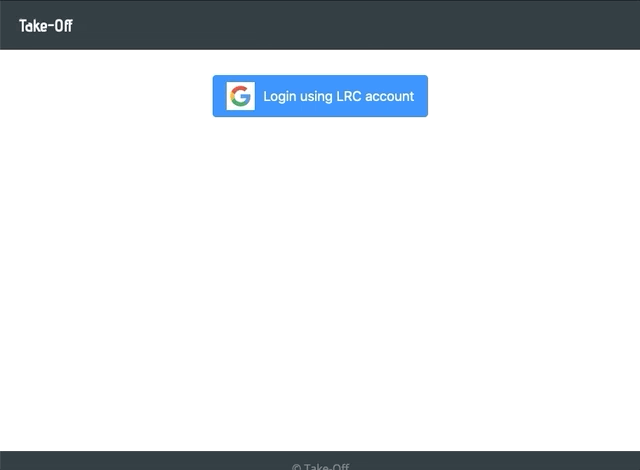

# Take-Off
This web application was built to manage requests for off days (vacation and sick leave) for the [Legal Rights Center](https://www.legalrightscenter.org) in Minneapolis, Minnesota.

Users can login and and are authenticated at employee-level or administrator-level. Employees can make requests for off days and then view the status of those requests. Administrators can view the requests of all users and accept or deny requests. The status of a given request (pending, approved, denied) is then communicated back to the employee.

A calendar view available to employees and administrators shows all active requests to help users visualize and plan. 

The application is mobile friendly.


## Setup and Run
You will need to follow the steps below to setup the database to get this up and running.

### 1. Create PostgreSQL database named 'take_off'
create db take_off (same as below but creating using SQL statements in terminal)

### 2. Create database tables using SQL create statements in 'database.sql'.
Run the statmesnt below in terminal:
psql -E -f database.sql -d take_off

### Optional: initalize database with sample data found in 'sample.sql'.
psql -E -f sample.sql -d take_off

### 3. Install Node dependencies/libraries using NPM
npm install

### 4. Start the server
npm run server

### 5. Start the client
npm run client

### 6. Application runs locally on PORT 3000

### 7. Login/Aunthentication
You will need to insert your email account into the employee table, because the application checks against the authenticated email google sends back against list of employees.


## Description

This is a full stack application built for a local non profit lawfirm. Employees are able to login in, see how many days they have available for Vacation, and how many days they have for Sick and Safe Time (this is a Minneapolis Ordinance that provide both sick and safe time for employees to use).
They make a request, the application tracks how many days they are taking, if it is over the weekend, the application knows not to include the weekend days.

### Login
Users login using their google accounts. Google OAuth was implemented for authentication to make logging in seamless and uniform for the users. After logging in with your google account, the application checks against the database to verify if the user is authorized to access the application. It checks against the database if a user is registered with the law firm and also if an user has an active status.

#### Employee Login View
When an employee logs in, they see the number of days they have available for Vacation and Sick and safe Time.
The application is mobile friendly, seeing most employees would access this on mobile devices.


<!-- Employee Login             |  Employee Makes Request   | Employee Calendar
:-------------------------:|:-------------------------:|:-------------------------:
              |
                                                        |  -->

<p float="left">
     
    
    
</p>


#### Admin Login View
When the admin logs in, the application verifies if the user logging in is the admin. The admin has access to all the employee request, can approve or deny requests for the home page.




#### Employee Request
When an employee logs in, they are taken to the home page, the home page dispays the vacation and sick and safe days available. Clicking on the vacattion request, you are taken to the calendar page, which shows the start date; in a calendar form, and end date. You have the option of a half day (4 hours) or ful day (8 hours) to request. The application knows to track either the half day or full day.
On Submit Query, the request is sent to the admin for approval, and the user is taken to their request page. This shows all the requests: Pending, Approved and Denied.


#### Admin Page
The admin has access to all the employees requests and information.

## Utilized Web Stack
- `User Interface` - React, CSS, react-big-callendar, Material.ui, Sweetalert
- `Client` - React, Redux, Redux-Saga, Axios, Passport
- `Server` - Node.js, Express, Node-Cron
- `Database` - PostgreSQL


## Requirements
- Git
- Web browser
- Node and npm
- PostgreSQL


```bash
# 7. Configure your .env file with the following environment variables.
# Note: Do not put your .env file into version control. It will contain sensitive secret information

SERVER_SESSION_SECRET= # A Random String
CLIENT_ID= # Your Google Authentication Client ID
CLIENT_SECRET= # Your Google Authentication Client Secret
CALLBACK_URL=http://localhost:5000/api/user/auth/google/callback
SUCCESS_REDIRECT=http://localhost:3000/#/home
FAIL_REDIRECT=http://localhost:3000/#/login

```

## Features

### Completed Features
- [x] Login with the Passport Google authentication strategy
- [x] Employees can add requests for days off and administrators can view all requests
- [x] Administrators can approve or deny an employee's requests
- [x] Employees can cancel/withdraw requests if the requested dates are still in the future
- [x] Requests are filter and sorted depending on user selections and page context to generally place the most relevant requests forward 
- [x] Administrators can register new user accounts and edit the account data for existing users
- [x] Calendar views display all active requests to help employees and administrators plan time off

### Future Features
- [ ] Detect collisions between requested dates and all other requested dates
- [ ] Add accrued employee vacation and sick time throughout the year with Node-cron tasks
- [ ] Allow more flexible back and forth between employees and administrators such as an in-app way for employees the request retroactive changes to their requests 
- [ ] Add employee images to their request cards from their Google accounts
- [ ] Improve UX particularly with regard to request card buttons. These cards currently have somewhat flat and non-descript buttons. The buttons would ideally float right, include icons, and have colors suggestive of their functions.

## Deploy to Heroku
```bash
# 1. Create a Heroku project
heroku create <remote_project_name>

# 2. Activate the PostgreSQL addon
heroku addons:create heroku-postgresql:hobby-dev

# 3. Copy local database "take_off" to Heroku
heroku pg:push take_off DATABASE_URL

# 4. Setup server-side environment variables see section on setting up .env above. Add these environment variabes using the Heroku project web dashboard.
```

## Authors
- Bode Falade
- Sharmarke Duale
- Max Todd
- Mike Stockman
- Eli Friedman

## Acknowledgements
- We would like to thank Michael Friedman and the rest of the Legal Rights Center
- We would like to thank our instructors Chris Black, Kris Szfranski, Ally Boyd, and Dane Smith
- Thanks to our Prime Digital Academy cohort Zaurak